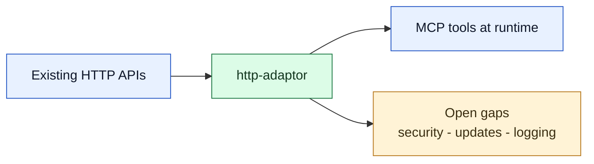

# http-adaptor Working Draft

**Status:** Active  
**Spec:** [spec.md](./spec.md)  
**Guide:** [guide.md](./guide.md)

---

## Overview

`http-adaptor` is a Phase 1 MCP server that turns existing HTTP APIs into callable MCP tools at runtime — no code changes required. This draft tracks the original requirement list against the current implementation, surfaces open gaps, and captures design choices that shaped the Phase 1 build.

---

## Background

The project started with sixteen requirements covering tool registration, invocation, monitoring, and access control. Phase 1 deliberately focused on the core runtime loop — register, invoke, list, and export — and deferred security hardening and operational tooling to later phases. The current scope boundary is reflected in this draft and the [specification](./spec.md).

The current implementation uses `httpx`, `tenacity`, `jsonschema`, `pydantic`, `PyYAML`, and `bcrypt` (reserved for the access-control path). It is a single-process, asyncio-based server with no external infrastructure dependencies beyond a local JSON file.

---

## Problem Statement

Without an HTTP-to-MCP adaptor, connecting any arbitrary HTTP API to an LLM requires custom glue code for every API. `http-adaptor` eliminates that burden by letting users register any HTTP endpoint at runtime and having it immediately appear as a named MCP tool the LLM can discover and call.

---

## Goals

- Turn existing HTTP APIs into MCP tools at runtime without writing code.
- Support bulk import from OpenAPI 3.x specs and export of registered tools.
- Validate inputs before dispatch and return clear, LLM-friendly error messages.
- Track per-tool call metrics in memory.
- Persist the tool registry to disk atomically across restarts.

---

## Non-Goals (Phase 1)

- Authentication of MCP clients connecting to `http-adaptor` itself.
- Secret vault integration or secret rotation for stored auth headers.
- Structured per-invocation call logs.
- Metrics persistence across restarts.
- OpenAPI v2 / Swagger 2.0 compatibility.
- Multi-process or distributed deployment of the registry.

---

## Scope at a Glance

---

## Requirement Status

| #  | Requirement                            | Status         | Notes                                                             |
|----|----------------------------------------|----------------|-------------------------------------------------------------------|
| 1  | Create a new HTTP API tool             | ✅ Implemented | `gateway_register_tool`                                           |
| 2  | Delete an HTTP API tool                | ✅ Implemented | `gateway_delete_tool`                                             |
| 3  | Query all registered tools             | ✅ Implemented | `gateway_list_tools` with pagination and tag filtering            |
| 4  | Group tools by tags                    | ✅ Implemented | Tag-based filtering via `gateway_list_tools`                      |
| 5  | Invoke registered APIs through MCP     | ✅ Implemented | Dynamic tools exposed by registered name                          |
| 6  | Monitor call metrics                   | ✅ Implemented | In-memory only — resets on restart                                |
| 7  | Record invocation logs                 | 🔲 Planned     | See T-03                                                          |
| 8  | Define APIs with JSON Schema           | ✅ Implemented | `input_schema` and `output_schema` fields                         |
| 9  | Support OpenAPI plus JSON Schema       | ✅ Implemented | Import OpenAPI 3.x, export OpenAPI 3.1                            |
| 10 | Validate inputs before dispatch        | ✅ Implemented | JSON Schema validation before HTTP call                           |
| 11 | Export registered APIs                 | ✅ Implemented | `gateway_export_openapi` → OpenAPI 3.1                            |
| 12 | Friendly error handling                | ✅ Implemented | Plain-language messages for LLM use                               |
| 13 | Retry failed requests                  | ✅ Implemented | Network errors and HTTP 5xx, configurable per tool                |
| 14 | Version management                     | ⚠️ Partial     | Naming conventions only (`tool_v2`); no `gateway_update_tool` yet |
| 15 | Generate tool definitions from OpenAPI | ✅ Implemented | OpenAPI 3.x import                                                |
| 16 | Permission control                     | 🔲 Planned     | `api_key_hash` exists in model, not enforced yet                  |

---

## Open Gaps

These items are carried forward to the next phase. Full details are in the spec [§8 Todo / Open Questions](./spec.md#8-todo--open-questions).

- [ ] **T-01 — Metrics persistence:** metrics reset on every restart; no persistence yet.
- [ ] **T-02 — Access control:** `api_key_hash` is defined but not wired up.
- [ ] **T-03 — Structured call log:** per-invocation records for debugging and audit.
- [ ] **T-04 — Update tool:** no `gateway_update_tool` yet; users must delete and re-register.
- [ ] **T-05 — Thread safety:** registry and metrics have no lock guarantees beyond single-process asyncio.
- [ ] **T-06 — Secret storage:** static auth headers persist as plain text in `tools.json`.
- [ ] **T-07 — OpenAPI v2 support:** only OpenAPI 3.x is supported today.

---

## Risks and Assumptions

| Risk                                                                          | Likelihood | Impact | Mitigation                                                  |
| ----------------------------------------------------------------------------- | ---------- | ------ | ----------------------------------------------------------- |
| Plain-text header storage exposes secrets if the registry file is readable    | Medium     | High   | Document clearly in guide and spec; address in T-06         |
| Missing access control allows unintended tool invocations                     | Medium     | High   | Enforce `api_key_hash` in T-02 before any public deployment |
| In-memory metrics lost on restart may hide silent failures                    | Low        | Medium | Add persistence in T-01                                     |
| Single-process asyncio registry may have race conditions if concurrency grows | Low        | Low    | Evaluate in T-05 before any multi-client HTTP deployment    |

**Key assumptions:**

- The server is single-process and asyncio — no concurrent writer guarantees are needed in Phase 1.
- Users deploying with HTTP transport in a trusted network are responsible for their own network-level access control.
- Tools registered via `gateway_register_tool` are trusted by the user who registers them.

---

## Design Principles

- Follow MCP server best practices: small focused management tools, explicit validation, clear error messages, and predictable runtime behavior.
- Keep the implementation extensible with clear module boundaries, Pydantic models, and atomic persistence.
- Prefer stable open-source libraries over custom infrastructure when a mature library already fits the problem.
- Keep documentation and tests aligned with the code so docs reflect implemented behavior, not guesses.

---

## Related References

- [guide.md](./guide.md) — beginner-friendly usage guide
- [spec.md](./spec.md) — authoritative specification

---

## Next Steps

1. Prioritize **T-02 (access control)** and **T-06 (secret storage)** before any shared or public deployment.
2. Add **T-04 (`gateway_update_tool`)** to unblock users who need to edit tool definitions in place.
3. Decide whether **T-01 (metrics persistence)** should block the next release or follow as a patch.
4. Review **T-07 (OpenAPI v2)** if user demand materializes.
