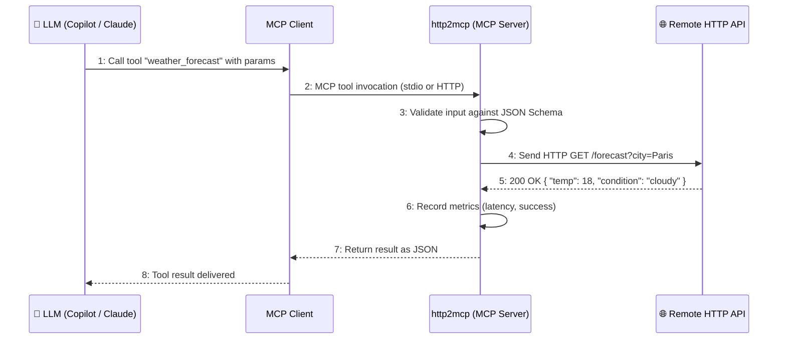

# HTTP2MCP Guide

**Specification:** [spec.md](./spec.md)  
**Draft:** [draft.md](./draft.md)  
**Source code:** [http2mcp](../http2mcp)

> 💡 This guide assumes no prior MCP experience. If you already know the basics, jump to [Quick Start](#3-quick-start).

---

## Audience

This guide is for developers and AI practitioners who want to connect HTTP APIs to an LLM without writing integration code. No prior MCP experience needed. Basic familiarity with REST APIs and a terminal is enough to get started.

**⏱️ Estimated time:** 15–20 minutes to read and run your first registered tool.

---

## 1. Overview

`http2mcp` is an **MCP server** that lets you turn any HTTP API into a tool that an AI assistant can call — without writing any code.

You register your HTTP APIs once (by name, URL, and method), and the server exposes them as MCP tools automatically. From that point on, any LLM connected to the server can discover and call those APIs on your behalf.

**Think of it as a universal remote control for HTTP APIs — one that your AI can operate.**

`http2mcp` has one job: turn existing HTTP APIs into MCP tools at runtime.

### 1.1 Names you'll see

- `http2mcp`: the server in this repository.
- `http2mcp_*`: built-in management tools such as `http2mcp_register_tool` and `http2mcp_list_tools`.
- Your registered tool names: the runtime MCP tools you add, such as `get_weather_forecast`.

---

## 2. Prerequisites

Before you start, you'll need:

- **Python 3.12+** — check with `python --version`
- **uv** — the package manager used for this project ([install guide](https://docs.astral.sh/uv/))
- A terminal (PowerShell, bash, etc.)
- An HTTP API you'd like to expose (or you can follow along with [httpbin.org](https://httpbin.org/))

---

## 3. Quick Start

```bash
# 1. Go to the project directory
cd path/to/http2mcp

# 2. Install dependencies
uv sync --all-groups

# 3. Start the server (stdio mode, for local use)
uv run http2mcp --transport stdio

# Or, start with HTTP transport (for remote/multi-client use)
uv run http2mcp --transport sse --host 127.0.0.1 --port 8000
```

Once running, point your MCP client (e.g. VS Code Copilot or Claude Desktop) at the server, and you're ready to go.

### 3.1 Configure startup settings and HTTP defaults

`http2mcp` resolves configuration in this order:

1. explicit CLI flags
2. `~/.http2mcp/config.toml`
3. built-in defaults

Example `config.toml`:

```toml
[mcp]
work_dir = "${http2mcp_WORK_DIR}"
transport = "sse"
host = "127.0.0.1"
port = 8000
timeout_seconds = 45.0
retry_max_attempts = 5
```

`config.toml` supports `${VAR_NAME}` placeholders inside string values. They are expanded from the current environment before TOML parsing, which is useful for paths and other machine-specific values.

`http2mcp` stores its registry at `<work_dir>/tools.json` and its metrics snapshot at `<work_dir>/metrics.json`.

If a registered or imported tool omits `timeout_seconds` or `retry_max_attempts`, the dispatcher uses the resolved app defaults at runtime. Explicit tool values still override the app defaults.

> 🔑 **VS Code config** (`mcp.json`):

**stdio (recommended for local use):**

```json
{
    "servers": {
        "http2mcp": {
            "type": "stdio",
            "command": "uv",
            "args": ["run", "--directory", "/path/to/http2mcp", "http2mcp"]
        }
    }
}
```

**Streamable HTTP:**

```json
{
  "servers": {
    "http2mcp": {
      "url": "http://127.0.0.1:8000/mcp"
    }
  }
}
```

---

## 4. Core Concepts

Before diving in, here are the five key ideas:

### 🔧 Tool

An **MCP tool** is a named action that an LLM can invoke. In http2mcp, each tool maps to one HTTP API endpoint. When an LLM calls the tool, http2mcp fires the matching HTTP request and returns the result.

### 🧰 Management Tools

The built-in management tools all use the `http2mcp_` prefix. They let you register, delete, list, import, export, and inspect tools. The tools you register do not need that prefix — they use whatever names you choose.

### 📋 Registry

The **registry** is the list of all your registered HTTP API tools. By default it lives at `~/.http2mcp/tools.json`, or at `<work_dir>/tools.json` if you override `work_dir` in config.

### 🚀 Dispatcher

The **dispatcher** is the component that actually fires HTTP requests. It handles retries on failures, validates your input against a JSON Schema (if you provided one), and always returns a clear, human-readable result — even when something goes wrong. The server keeps one shared HTTP client alive for the full app lifespan, so repeated tool calls can reuse connections efficiently. If a tool omits `timeout_seconds` or `retry_max_attempts`, the dispatcher falls back to the app-level defaults from the resolved configuration.

### 📊 Metrics

`http-adaptor` tracks **metrics** for every tool call: how many times it was called, how many succeeded, average response time, and more. The runtime reloads metrics from `<work_dir>/metrics.json` on startup and writes them back on graceful shutdown, so clean restarts keep history.

---

## 5. Architecture Overview

Here's how data flows when an LLM calls a registered HTTP tool:



The same flow also depends on the registry and metrics components behind the scenes. The full component view lives in the [specification](./spec.md#2-architecture).

At startup, each `http2mcp` app instance creates its own runtime scope. That runtime owns the shared HTTP client, loads the persisted tools from disk, and registers both management tools and dynamic tools for that app instance.

`http2mcp` also exposes **management tools** — these let the LLM (or you) register, delete, list, and inspect tools without restarting the server. Management tools always use the `http2mcp_` prefix. The runtime tools you register keep the names you chose.

---

## 6. How to Use It: Step by Step

### Step 1 — Register an HTTP API as a tool

Use the `http2mcp_register_tool` tool (via your MCP client):

```json
{
  "name": "get_joke",
  "description": "Fetch a random programming joke",
  "url": "https://official-joke-api.appspot.com/jokes/programming/random",
  "method": "GET"
}
```

The tool is immediately available and persisted to disk.

### Step 2 — Ask the LLM to call it

Tell your AI: *"Use the get_joke tool to fetch a joke."*  
The LLM will invoke `get_joke`, and the http2mcp will fire the HTTP request, then return the result.

### Step 3 — List your registered tools

Use `http2mcp_list_tools` to see everything in the registry:

```json
{ "limit": 20 }
```

You can also filter by tag: `{ "tags": ["weather", "public"] }`.

The list view is intentionally compact. It shows discovery metadata and live call counts, but not stored headers or full schemas.

### Step 4 — Import from OpenAPI (bulk registration)

If you have an OpenAPI spec file, you can import all operations at once:

```json
{
  "spec_path": "/path/to/my-api.yaml",
  "filter_tags": ["public"]
}
```

This creates one MCP tool per API operation automatically.

### Step 5 — Check metrics

Use `http2mcp_get_metrics` to see call stats for all your tools:

```json
{
  "get_joke": {
    "call_count": 12,
    "success_count": 11,
    "success_rate": 0.92,
    "avg_latency_ms": 340,
    "p95_latency_ms": 610
  }
}
```

Metrics are reloaded from `<work_dir>/metrics.json` on startup and saved again on graceful shutdown. If the process is killed abruptly, the latest samples can still be lost.

---

## 7. Real-World Use Cases

| Use case | How |
| --- | --- |
| **Connect a private REST API to Copilot** | Register your internal API endpoints using `http2mcp_register_tool` |
| **Import an entire OpenAPI service** | Use `http2mcp_import_openapi` to bulk-register all endpoints from a spec file |
| **Add auth headers automatically** | Set `headers: { "Authorization": "Bearer ${MY_API_TOKEN}" }` at registration time so the secret is resolved at request time |
| **Monitor API health from the LLM** | Ask the LLM to call `http2mcp_get_metrics` and summarize slow or failing tools |
| **Share your tool catalog** | Use `http2mcp_export_openapi` to export your registered tools as an OpenAPI spec |

---

## 8. Security Considerations

> ⚠️ Read this before deploying in a shared or networked environment.

A few important things to keep in mind:

1. **Never put secrets in tool names or descriptions.** Those fields are meant for discovery and should stay safe to show to users and LLMs.

2. **Treat the work directory as secret material if you use auth headers.** Static headers are still stored in plain text in `tools.json` today. Prefer `${VAR_NAME}` placeholders when you can so the real secret stays in the environment.

3. **Do not rely on `api_key_hash` yet.** The field exists in the model, but Phase 1 does not enforce API-key-based tool access. See [T-02 in the spec](./spec.md#8-todo--open-questions).

4. **Prefer HTTPS endpoints.** The dispatcher will call `http://` URLs too, but plain HTTP traffic is unencrypted.

5. **Use stdio transport for local use.** When running locally, stdio keeps communication on your machine. HTTP transport opens a network port, so bind carefully.

---

## 9. Common Pitfalls

| Symptom | Likely cause | Fix |
| --- | --- | --- |
| Tool not found after restart | Tools *are* persisted — check your `work_dir` | Run with the same `work_dir` each time |
| Input validation error (422) | The params you sent don't match `input_schema` | Check the schema or send the required fields |
| "Not found — the API endpoint does not exist" | Wrong URL registered | Delete and re-register with the correct URL |
| Timeout on every call | Remote API is slow | Increase the app default in config, or set a higher per-tool `timeout_seconds` override |
| `DuplicateToolError` on import | Tool name already registered | Use `filter_tags` to skip unwanted operations, or delete the old tool first |
| Metrics show 0 after restart | The previous process did not shut down cleanly, or you started with a different `work_dir` | Reuse the same `work_dir` and stop the server cleanly so `metrics.json` is written |
| Need to change a tool definition | There is no update tool yet | Delete the tool and register it again |

---

## 10. Tips and Best Practices

- **Name tools clearly.** Use snake_case names that describe what the tool does: `get_weather_forecast`, not `api1`. The LLM uses the name and description to decide when to call it.

- **Always add a description.** A good description helps the LLM know *when* and *how* to use the tool. Include the main parameters and what the result looks like.

- **Use `input_schema` for important tools.** If your API has required parameters, define them with a JSON Schema. The http2mcp will catch bad inputs before they ever hit the remote API.

- **Add tags for organization.** When you have many tools, tags make it easy to find related ones with `http2mcp_list_tools { "tags": [...] }`.

- **Use version suffixes for evolving APIs.** If an API changes, register the new version as `my_tool_v2` and keep `my_tool_v1` running until you're ready to migrate.

- **Set realistic app defaults.** The built-in timeout is 30 seconds and the built-in retry count is 3. Tune them in config for your environment, then add per-tool overrides only when a specific API needs different behavior.

- **Remember what gets retried.** Network failures and HTTP 5xx responses are retried. HTTP 4xx responses are returned immediately because they usually indicate a bad request or missing auth.

---

## 11. Verification

Not sure if things are working? Try this quick check:

1. Start the server: `uv run http2mcp --transport stdio`
2. In your MCP client, call `http2mcp_list_tools {}` — you should see an empty list with no errors.
3. Register a tool and call it back — if you get a response, the full loop is working.

---

## 12. Next Steps

Now that you know the basics, here's what to explore next:

- 📖 Read the full [Specification](./spec.md) to understand all fields, validation rules, and the complete tool API.
- 🗺️ Check the [draft](./draft.md) for the current requirement status and open gaps.
- 🔌 Connect to a real API — try registering a public REST API like [JSONPlaceholder](https://jsonplaceholder.typicode.com/).
- 📦 Import a full OpenAPI spec with `http2mcp_import_openapi` to bulk-register dozens of endpoints.
- 🛡️ Follow [T-02 in the spec](./spec.md#8-todo--open-questions) for updates on the API key access control feature.
- 🤝 Contribute — the open TODOs in the spec are good first issues: access control, update tool exposure, and stronger secret handling.
