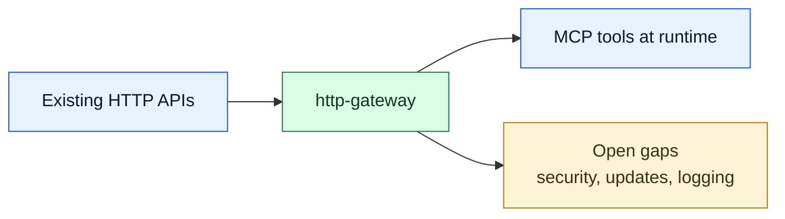

# http-gateway Draft

This draft captures the current working scope for `http-gateway` and reviews the original requirement list against the implementation that exists today.

## Goal

Turn existing HTTP APIs into MCP tools at runtime.

## Scope at a glance

## Design principles

- Follow MCP server best practices: small management tools, explicit validation, clear error messages, and predictable runtime behavior.
- Keep implementation extensible and maintainable with clear module boundaries, Pydantic models, and atomic persistence.
- Prefer stable open-source libraries over custom infrastructure when a mature library already fits the problem.
- Keep documentation and tests aligned with the code so the docs reflect implemented behavior, not guesses.

Current implementation already relies on mature libraries that fit these goals: `httpx`, `tenacity`, `jsonschema`, `pydantic`, `PyYAML`, and `bcrypt` for the planned access-control path.

## Requirement review

1. Create a new HTTP API tool: implemented with `gateway_register_tool`.
2. Delete an HTTP API tool: implemented with `gateway_delete_tool`.
3. Query all registered tools: implemented with `gateway_list_tools`, including pagination and tag filtering.
4. Group tools by tags: implemented through the `tags` field and list filtering.
5. Invoke registered APIs through MCP: implemented through dynamically registered tools.
6. Monitor call metrics: implemented with in-memory metrics for call count, success rate, and latency.
7. Record invocation logs: planned, not implemented yet.
8. Define APIs with JSON Schema: implemented through `input_schema` and `output_schema` fields.
9. Support OpenAPI plus JSON Schema descriptions: implemented for OpenAPI 3.x import and OpenAPI 3.1 export.
10. Validate inputs before dispatch: implemented with JSON Schema validation.
11. Export registered APIs: implemented with `gateway_export_openapi`.
12. Friendly error handling: implemented with plain-language error messages for LLM use.
13. Retry failed requests: implemented for network failures and HTTP 5xx responses.
14. Version management: partially implemented through naming conventions such as `tool_v2`; there is no dedicated update API yet.
15. Generate tool definitions from OpenAPI: implemented for OpenAPI 3.x import.
16. Permission control: planned, not implemented yet. The `api_key_hash` field exists in the model but is not enforced.

## Current gaps to carry forward

- [ ] Metrics persist across restarts.
- [ ] `gateway_update_tool` exists so users can edit a tool in place.
- [ ] Static request headers move away from plain-text registry storage.
- [ ] Structured invocation logs are available for debugging and audit.
- [ ] OpenAPI v2 compatibility is supported.

## Documentation map

- [http-gateway-guide.md](./http-gateway-guide.md): beginner-friendly usage guide.
- [http-gateway-spec.md](./http-gateway-spec.md): authoritative specification for the implemented server.
- [http-gateway-phase-scope-adr.md](./http-gateway-phase-scope-adr.md): naming and scope decision for the current server.

Use this draft as the working summary. Use the guide and spec as the source of truth for day-to-day usage and exact behavior.
