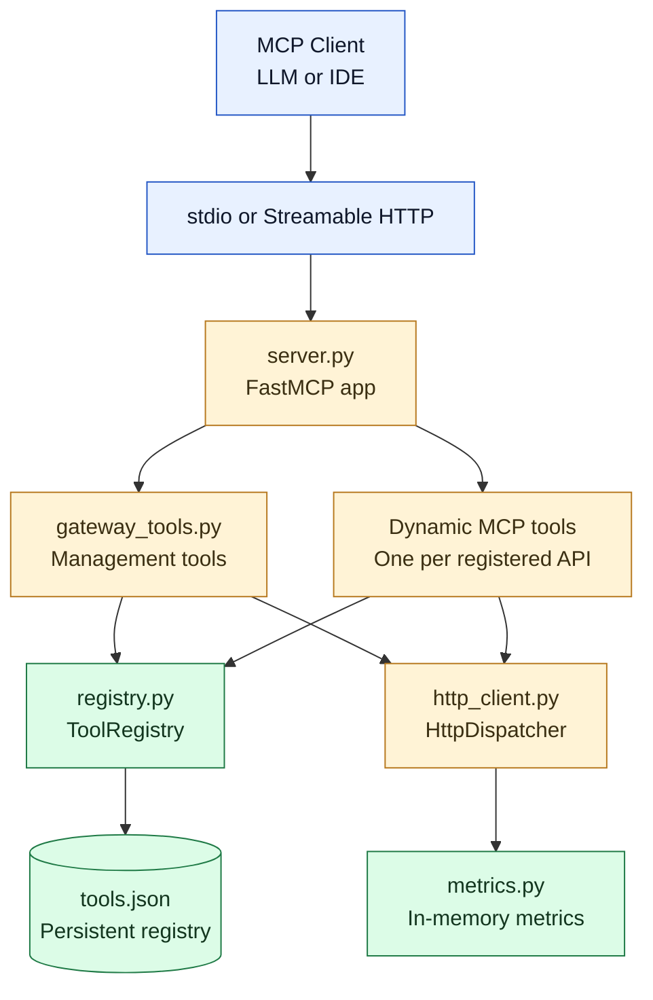

# http-gateway MCP Specification

**Version:** 0.1.0  
**Status:** Phase 1 HTTP-to-MCP server — Active Development  
**Source:** [mcp-servers/http_gateway/](../mcp-servers/http_gateway/)  
**Guide:** [http-gateway-guide.md](./http-gateway-guide.md)  
**ADR:** [http-gateway-phase-scope-adr.md](./http-gateway-phase-scope-adr.md)  
**Draft:** [http-gateway-draft.md](./http-gateway-draft.md)

---

## 1. Purpose

`http-gateway` is an MCP server that acts as a bridge between LLMs and existing HTTP APIs. It lets users register any HTTP endpoint as an MCP tool at runtime — no code changes needed. The LLM can then discover and call those tools directly.

**Scope:** turn existing HTTP APIs into MCP tools at runtime.

### 1.1 Naming and scope

- `http-gateway` is the server documented in this repository.
- `http-gateway-mcp` is the published Python package name.
- `http_gateway_mcp` is the FastMCP runtime identifier used by the server.

This specification documents the current implemented server only.

### 1.2 Capability status

| Capability | Status in v0.1.0 | Notes |
| --- | --- | --- |
| Register a new HTTP API as an MCP tool | Implemented | `gateway_register_tool` |
| Delete a registered tool | Implemented | `gateway_delete_tool` |
| List tools with discovery metadata | Implemented | `gateway_list_tools` with pagination and tag filtering |
| Group tools by user-defined tags | Implemented | Grouping is tag-based rather than separate group objects |
| Invoke registered APIs through MCP | Implemented | Dynamic tools are exposed by their registered names |
| Metrics and monitoring | Implemented with limits | Metrics are in memory only and reset on restart |
| Structured invocation logs | Planned | Not implemented in Phase 1 |
| JSON Schema-based input and output definitions | Implemented | Input validation is enforced before dispatch |
| OpenAPI import and export | Implemented | Import supports OpenAPI 3.x; export emits OpenAPI 3.1 |
| Friendly validation and error handling | Implemented | LLM-friendly messages for validation, HTTP, and network failures |
| Retry on transient failures | Implemented | Network errors and HTTP 5xx are retried; HTTP 4xx are not |
| Tool version management | Partially implemented | Supported through naming conventions such as `tool_v2`; no dedicated update/version API |
| Access control on tool invocation | Planned | `api_key_hash` exists in the model but is not enforced yet |

---

## 2. Architecture

### Module responsibilities

| Module             | Responsibility                                              |
| ------------------ | ----------------------------------------------------------- |
| `server.py`        | FastMCP app factory, CLI entry point, startup loader        |
| `gateway_tools.py` | All `@mcp.tool` handlers + dynamic tool registration        |
| `registry.py`      | In-memory CRUD store backed by atomic JSON file             |
| `http_client.py`   | HTTP dispatch, JSON Schema validation, retry, LLM errors    |
| `openapi.py`       | OpenAPI 3.x import (file → tools) and export (tools → spec) |
| `metrics.py`       | In-memory per-tool call counters and latency tracking       |
| `models.py`        | Shared Pydantic v2 domain models                            |

---

## 3. Domain models

### 3.1 ToolDefinition

The canonical definition of a registered HTTP API tool. Persisted to `tools.json`.

| Field                   | Type             | Default   | Constraints                                 | Description                                                          |
| ----------------------- | ---------------- | --------- | ------------------------------------------- | -------------------------------------------------------------------- |
| `name`                  | `str`            | required  | `^[a-z][a-z0-9_]*$`, 1–128 chars            | Unique MCP tool name in snake_case                                   |
| `description`           | `str`            | required  | 1–1024 chars                                | Human-readable description for LLMs                                  |
| `url`                   | `str`            | required  | `http://` or `https://` prefix              | Target HTTP endpoint                                                 |
| `method`                | `str`            | `"GET"`   | One of: GET, POST, PUT, PATCH, DELETE, HEAD | HTTP method                                                          |
| `headers`               | `dict[str, str]` | `{}`      | —                                           | Static request headers                                               |
| `tags`                  | `list[str]`      | `[]`      | max 20 items                                | User-defined tags for grouping                                       |
| `input_schema`          | `dict \| None`   | `None`    | Valid JSON Schema object                    | Validates input params before dispatch                               |
| `output_schema`         | `dict \| None`   | `None`    | Valid JSON Schema object                    | Describes expected response shape                                    |
| `api_key_hash`          | `str \| None`    | `None`    | bcrypt hash                                 | Reserved for future access control                                   |
| `retry_max_attempts`    | `int`            | `3`       | 1–10                                        | Max retries on transient failures                                    |
| `retry_backoff_seconds` | `float`          | `1.0`     | 0 < x ≤ 60                                  | Initial backoff for exponential retry                                |
| `timeout_seconds`       | `float`          | `30.0`    | 0 < x ≤ 300                                 | Per-request timeout                                                  |
| `created_at`            | `datetime`       | now (UTC) | —                                           | Registration timestamp                                               |
| `updated_at`            | `datetime`       | now (UTC) | —                                           | Last update timestamp                                                |

Notes:

- `headers` are persisted directly in the registry JSON file, so long-lived secrets should be handled carefully.
- `api_key_hash` exists in the model, but Phase 1 does not enforce API-key-based tool access yet.

### 3.2 MetricEntry

In-memory per-tool call statistics. Reset on server restart.

| Field              | Type               | Description                            |
| ------------------ | ------------------ | -------------------------------------- |
| `tool_name`        | `str`              | Tool identifier                        |
| `call_count`       | `int`              | Total calls                            |
| `success_count`    | `int`              | Calls with 2xx response                |
| `error_count`      | `int`              | Calls with non-2xx or exception        |
| `total_latency_ms` | `float`            | Cumulative latency                     |
| `latency_samples`  | `list[float]`      | All latency values for percentile calc |
| `avg_latency_ms`   | `float` (computed) | `total_latency_ms / call_count`        |
| `success_rate`     | `float` (computed) | `success_count / call_count`           |
| `p95_latency_ms`   | `float` (computed) | 95th percentile of latency samples     |

### 3.3 InvokeResult

Return value from `HttpDispatcher.invoke()`. Never raises.

| Field         | Type              | Description                                   |
| ------------- | ----------------- | --------------------------------------------- |
| `tool_name`   | `str`             | Tool that was invoked                         |
| `status_code` | `int`             | HTTP status code (422 for validation error)   |
| `body`        | `str \| dict`     | Parsed JSON or raw text response body         |
| `latency_ms`  | `float`           | Round-trip latency                            |
| `retries`     | `int`             | Number of retry attempts made                 |
| `error`       | `str \| None`     | LLM-friendly error message, `None` on success |
| `is_success`  | `bool` (computed) | `True` when `error is None`                   |

---

## 4. MCP tools

### 4.1 Management tools (always available)

#### `gateway_register_tool`

Registers a new HTTP API endpoint as an MCP tool. The tool is immediately callable and persisted.

**Input (`RegisterToolInput`):**

| Param                   | Type        | Required | Description                        |
| ----------------------- | ----------- | -------- | ---------------------------------- |
| `name`                  | `str`       | Yes      | Unique tool name (snake_case)      |
| `description`           | `str`       | Yes      | What the tool does                 |
| `url`                   | `str`       | Yes      | Target URL                         |
| `method`                | `str`       | No       | HTTP method (default `GET`)        |
| `headers`               | `dict`      | No       | Static headers                     |
| `tags`                  | `list[str]` | No       | Grouping tags                      |
| `input_schema`          | `dict`      | No       | JSON Schema for input validation   |
| `output_schema`         | `dict`      | No       | JSON Schema for output description |
| `retry_max_attempts`    | `int`       | No       | 1–10 (default 3)                   |
| `retry_backoff_seconds` | `float`     | No       | >0 (default 1.0)                   |
| `timeout_seconds`       | `float`     | No       | >0 (default 30.0)                  |

**Returns:** JSON `{ success, tool_name, message }` or `{ success: false, error }`.

---

#### `gateway_delete_tool`

Removes a registered tool by name from the registry and disk.

**Input:** `{ name: str }`  
**Returns:** JSON `{ success, message }` or `{ success: false, error }`.

---

#### `gateway_list_tools`

Returns a paginated list of registered tools with live call-count from metrics.

**Input (`ListToolsInput`):**

| Param    | Type                | Description                           |
| -------- | ------------------- | ------------------------------------- |
| `tags`   | `list[str] \| None` | Filter: return tools matching ANY tag |
| `limit`  | `int`               | Page size 1–100 (default 50)          |
| `offset` | `int`               | Pagination offset (default 0)         |

**Returns:** JSON `PaginatedToolList` — `{ total, count, offset, has_more, next_offset, items[] }`.  
Each item: `{ name, description, url, method, tags, call_count, success_rate }`.

The summary output intentionally excludes stored headers and schemas so the discovery view stays compact.

---

#### `gateway_get_metrics`

Returns all per-tool invocation stats. Resets on server restart.

**Input:** none  
**Returns:** JSON `{ [tool_name]: { call_count, success_count, error_count, success_rate, avg_latency_ms, p95_latency_ms } }`.

---

#### `gateway_import_openapi`

Bulk-imports HTTP API tools from an OpenAPI 3.x spec file (JSON or YAML). Skips duplicate names.

**Input (`ImportOpenAPIInput`):**

| Param               | Type                | Description                                |
| ------------------- | ------------------- | ------------------------------------------ |
| `spec_path`         | `str`               | Absolute path to spec file                 |
| `filter_tags`       | `list[str] \| None` | Only import operations matching these tags |
| `base_url_override` | `str \| None`       | Override the server base URL from spec     |

**Returns:** JSON `{ success, imported[], skipped_duplicates[], failed[], summary }`.

---

#### `gateway_export_openapi`

Exports all registered tools as an OpenAPI 3.1 spec.

**Input (`ExportOpenAPIInput`):**

| Param      | Type  | Description                                      |
| ---------- | ----- | ------------------------------------------------ |
| `base_url` | `str` | Server URL (default `https://gateway.localhost`) |
| `title`    | `str` | API title (default `http-gateway MCP Tools`)     |

**Returns:** OpenAPI 3.1 spec serialized as a JSON string.

---

### 4.2 Dynamic tools (one per registered API)

Each registered HTTP API is exposed as an MCP tool with its configured `name` and `description`. On invocation:

1. Parameters are passed through to `HttpDispatcher.invoke()`
2. Input is validated against `input_schema` (if set)
3. Request is dispatched with retry and timeout
4. Result is returned as JSON `{ status_code, body, latency_ms, retries }` or `{ error, status_code, retries, tool }`

---

## 5. HTTP dispatch behavior

### 5.1 Parameter placement

| Method            | Params sent as |
| ----------------- | -------------- |
| GET, HEAD, DELETE | Query string   |
| POST, PUT, PATCH  | JSON body      |

### 5.2 Retry policy

Uses `tenacity` with exponential backoff. Retries on:

- `httpx.TimeoutException`
- `httpx.ConnectError`
- HTTP 5xx responses

Controlled per-tool via `retry_max_attempts` and `retry_backoff_seconds`.

### 5.3 LLM-friendly errors

All errors (network, HTTP status, validation) are converted to plain-language strings that are safe to return directly to an LLM. HTTP status → message mapping:

| Status | Message                                              |
| ------ | ---------------------------------------------------- |
| 400    | Bad request — the API rejected the input parameters. |
| 401    | Unauthorized — the API requires authentication.      |
| 403    | Forbidden — you do not have permission.              |
| 404    | Not found — the API endpoint does not exist.         |
| 429    | Rate limited — too many requests.                    |
| 5xx    | Server error variants.                               |

---

## 6. Persistence

### 6.1 Registry file

Tools are stored in a single JSON file (`~/.http_gateway/tools.json` by default, overridable via `--storage`).

Writes use **write-then-rename** (`tempfile.mkstemp` + `Path.replace`) to prevent corruption on crash.

The stored payload contains the full `ToolDefinition`, including static headers. This keeps the format simple and portable, but it also means long-lived secrets should not be stored casually in the default registry file.

### 6.2 Metrics

Metrics are **in-memory only** and reset on server restart. Disk persistence is planned (see §8 TODO).

---

## 7. Transport

Selectable at startup via `--transport` flag:

| Flag                          | Transport       | Use case                            |
| ----------------------------- | --------------- | ----------------------------------- |
| `--transport stdio` (default) | Stdio           | Local use — VS Code, Claude Desktop |
| `--transport http`            | Streamable HTTP | Remote / multi-client deployment    |

`host` and `port` are passed to the `FastMCP` constructor (default `127.0.0.1:8000`).  
HTTP path: `/mcp`.

---

## 8. Todo / Open questions

- [ ] **T-01: Metrics persistence**
    Persist `MetricsCollector` state to `metrics.json` on graceful shutdown and reload on startup.
    Priority: Medium.
    Note: metrics currently reset on every restart.

- [ ] **T-02: Access control**
    Wire up `api_key_hash` with bcrypt verification on incoming gateway calls.
    Priority: High.
    Note: the field exists in `ToolDefinition`, and `bcrypt` is already a dependency.

- [ ] **T-03: Structured call log**
    Record per-invocation log entries for debugging and audit.
    Priority: Low.
    Note: this comes from draft requirement 7.

- [ ] **T-04: Update tool**
    Add `gateway_update_tool` so users can patch individual fields without delete and re-register.
    Priority: Medium.
    Note: there is no update path today.

- [ ] **T-05: Concurrency and thread safety**
    Decide whether the registry and metrics collector need stronger thread-safety guarantees for future deployment modes.
    Priority: Low.
    Note: the current single-process asyncio server is acceptable.

- [ ] **T-06: Secret storage strategy**
    Replace plain-text storage of static auth headers with secret references or another secure storage approach.
    Priority: High.
    Note: the current registry persists `headers` directly to disk.

- [ ] **T-07: OpenAPI v2 support**
    Add Swagger 2.0 compatibility.
    Priority: Low.
    Note: only OpenAPI 3.x is validated today.

---

## 9. Non-goals (Phase 1)

- Authentication of MCP clients connecting to http-gateway itself
- Multi-process or distributed registry
- Secret vault integration or secret rotation workflows
- Rate limiting of outbound HTTP calls
